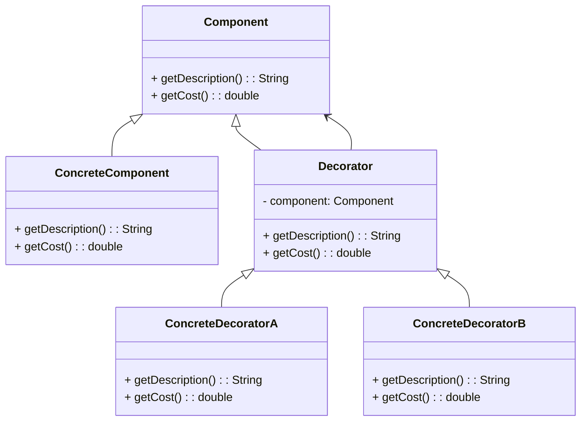

# Decorator Design Pattern

## Definition
The **Decorator Design Pattern** is a structural design pattern that allows behavior to be added to individual objects, dynamically, without affecting the behavior of other objects from the same class.

## Key Components
1. **Component**:
    - An interface or abstract class defining the methods that will be implemented.

2. **ConcreteComponent**:
    - A class that implements the Component interface. This is the original object to which additional responsibilities can be attached.

3. **Decorator**:
    - An abstract class that implements the Component interface and contains a reference to a Component object. It delegates all operations to the component it decorates.

4. **ConcreteDecorator**:
    - A class that extends the Decorator class and adds responsibilities to the component.

## UML Diagram



## Example Code

### Component Interface
```java
public interface Coffee {
    String getDescription();
    double getCost();
}
```

### ConcreteComponent Implementation
```java
public class BasicCoffee implements Coffee {
    @Override
    public String getDescription() {
        return "Basic Coffee";
    }

    @Override
    public double getCost() {
        return 50.0;
    }
}
```

### Decorator Abstract Class
```java
public abstract class CoffeeDecorator implements Coffee {
    protected final Coffee coffee;

    public CoffeeDecorator(Coffee coffee) {
        this.coffee = coffee;
    }

    @Override
    public String getDescription() {
        return coffee.getDescription();
    }

    @Override
    public double getCost() {
        return coffee.getCost();
    }
}
```

### ConcreteDecorator Implementations
#### MilkDecorator
```java
public class MilkDecorator extends CoffeeDecorator {
    public MilkDecorator(Coffee coffee) {
        super(coffee);
    }

    @Override
    public String getDescription() {
        return super.getDescription() + ", Milk";
    }

    @Override
    public double getCost() {
        return super.getCost() + 10.0;
    }
}
```

#### SugarDecorator
```java
public class SugarDecorator extends CoffeeDecorator {
    public SugarDecorator(Coffee coffee) {
        super(coffee);
    }

    @Override
    public String getDescription() {
        return super.getDescription() + ", Sugar";
    }

    @Override
    public double getCost() {
        return super.getCost() + 5.0;
    }
}
```

### Main Class
```java
public class Application {
    public static void main(String[] args) {
        Coffee basicCoffee = new BasicCoffee();
        System.out.println(basicCoffee.getDescription() + " -> ₹" + basicCoffee.getCost());

        Coffee milkCoffee = new MilkDecorator(basicCoffee);
        System.out.println(milkCoffee.getDescription() + " -> ₹" + milkCoffee.getCost());

        Coffee sugarMilkCoffee = new SugarDecorator(milkCoffee);
        System.out.println(sugarMilkCoffee.getDescription() + " -> ₹" + sugarMilkCoffee.getCost());
    }
}
```

## Advantages
- Provides greater flexibility than static inheritance.
- Enhances the behavior of individual objects without affecting other objects of the same class.

## Disadvantages
- Can result in a large number of small classes that are difficult to manage.
- Can be complex to implement and understand.