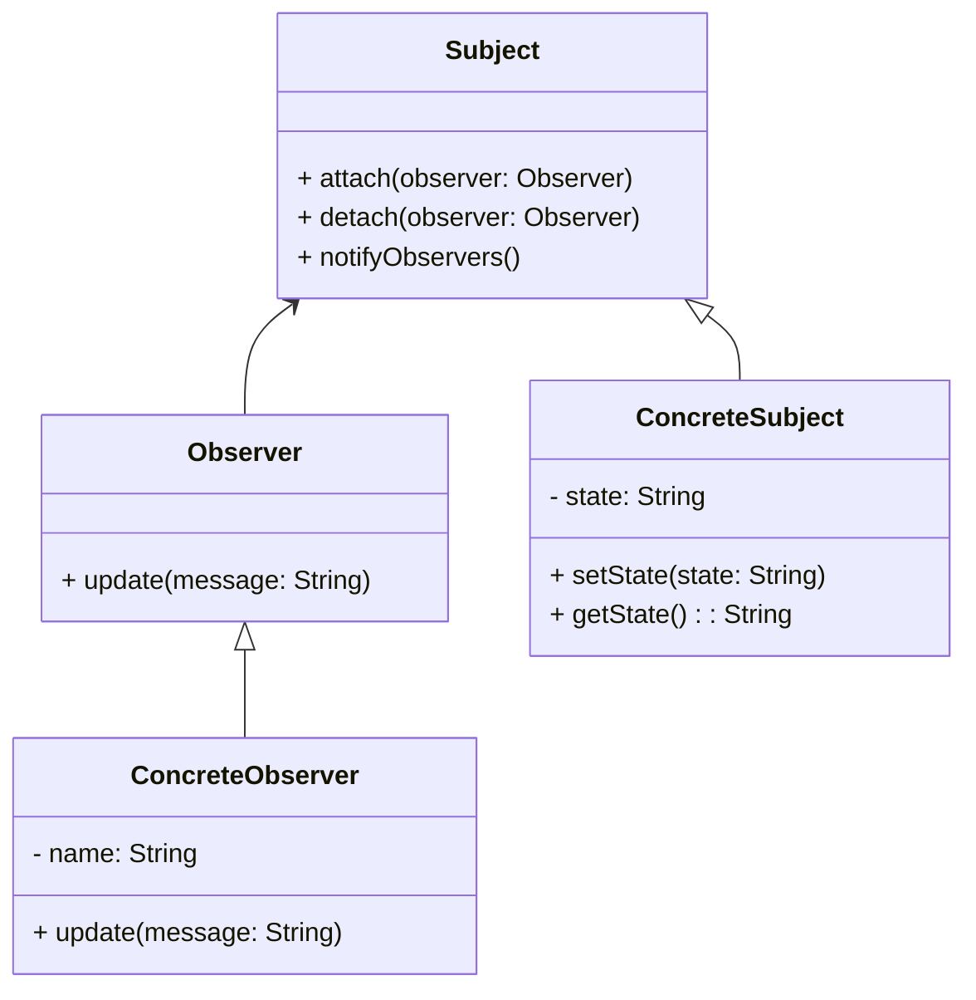

# Observer Design Pattern

## Definition
The **Observer Design Pattern** is a behavioral design pattern where an object, known as the **subject**, maintains a list of dependents, called **observers**, and notifies them of any state changes, typically by calling one of their methods.

## Key Components
1. **Subject**:
    - Maintains a list of observers.
    - Provides methods to attach, detach, and notify observers.

2. **Observer**:
    - An interface or abstract class that defines the `update` method to be implemented by concrete observers.

3. **ConcreteSubject**:
    - Extends the Subject and stores its state.
    - Notifies observers when its state changes.

4. **ConcreteObserver**:
    - Implements the Observer interface.
    - Updates its state to keep it consistent with the subject's state.

## UML Diagram



## Example Code

### Subject Interface
```java
public interface StockObservable {
    void add(NotificationAlertObserver notificationAlertObserver);
    void remove(NotificationAlertObserver notificationAlertObserver);
    void notifySubscribers();
    void setStockCount(int newStockAdded);
    int getStockCount();
}
```

### ConcreteSubject Implementation
```java
import java.util.ArrayList;
import java.util.List;

public class IphoneObservableImpl implements StockObservable {
    private final List<NotificationAlertObserver> observerList = new ArrayList<>();
    private int stockCount = 0;

    @Override
    public void add(NotificationAlertObserver notificationAlertObserver) {
        observerList.add(notificationAlertObserver);
    }

    @Override
    public void remove(NotificationAlertObserver notificationAlertObserver) {
        observerList.remove(notificationAlertObserver);
    }

    @Override
    public void notifySubscribers() {
        observerList.forEach(NotificationAlertObserver::update);
    }

    @Override
    public void setStockCount(int newStockAdded) {
        stockCount += newStockAdded;
        if (stockCount - newStockAdded == 0) {
            notifySubscribers();
        }
    }

    @Override
    public int getStockCount() {
        return stockCount;
    }
}
```

### Observer Interface
```java
public interface NotificationAlertObserver {
    void update();
}
```

### ConcreteObserver Implementations
#### Email Alert Observer
```java
public class EmailAlertObserverImpl implements NotificationAlertObserver {
    private final String email;
    private final StockObservable stockObservable;

    public EmailAlertObserverImpl(String email, StockObservable stockObservable) {
        this.email = email;
        this.stockObservable = stockObservable;
    }

    @Override
    public void update() {
        sendMail();
    }

    private void sendMail() {
        System.out.println("email sent to " + email + " with info: New Stock - " + stockObservable.getStockCount());
    }
}
```

#### Mobile Alert Observer
```java
public class MobileAlertObserverImpl implements NotificationAlertObserver {
    private final String phone;
    private final StockObservable stockObservable;

    public MobileAlertObserverImpl(String phone, StockObservable stockObservable) {
        this.phone = phone;
        this.stockObservable = stockObservable;
    }

    @Override
    public void update() {
        sendText();
    }

    private void sendText() {
        System.out.println("msg sent to " + phone + " with info: New Stock - " + stockObservable.getStockCount());
    }
}
```

### Main Class
```java
public class Store {
    public static void main(String[] args) {
        StockObservable iphoneStockObservable = new IphoneObservableImpl();

        NotificationAlertObserver observer1 = new EmailAlertObserverImpl("abc@gmail.com", iphoneStockObservable);
        NotificationAlertObserver observer2 = new MobileAlertObserverImpl("123-123-123", iphoneStockObservable);

        iphoneStockObservable.add(observer1);
        iphoneStockObservable.add(observer2);

        iphoneStockObservable.setStockCount(10);
    }
}
```

## Advantages
- Promotes loose coupling between the subject and observers.
- Observers can be added or removed at runtime.

## Disadvantages
- Can lead to memory leaks if observers are not properly removed.
- May cause performance issues with a large number of observers.