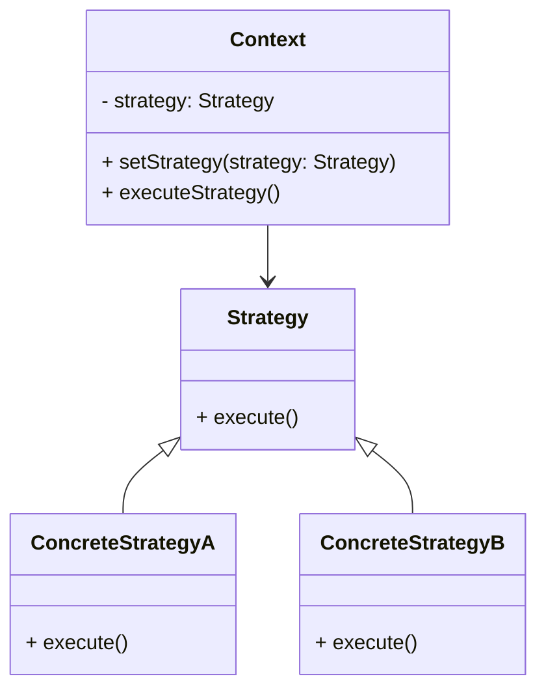

# Strategy Design Pattern

## Definition
The **Strategy Design Pattern** is a behavioral design pattern that enables selecting an algorithm's behavior at runtime. It defines a family of algorithms, encapsulates each one, and makes them interchangeable. This pattern allows the algorithm to vary independently from the clients that use it.

## Key Components
1. **Strategy**:
    - An interface that defines a method or methods that all concrete strategies must implement.

2. **ConcreteStrategy**:
    - Implements the Strategy interface and provides the specific behavior of the algorithm.

3. **Context**:
    - Maintains a reference to a Strategy object.
    - Allows the strategy to be set or changed at runtime.
    - Delegates the algorithm's execution to the Strategy object.

## UML Diagram



## Example Code

### Strategy Interface
```java
public interface DriveStrategy {
    void drive();
}
```

### ConcreteStrategy Implementations
#### NormalDriveStrategy
```java
public class NormalDriveStrategy implements DriveStrategy {
    @Override
    public void drive() {
        System.out.println("with strategy normal drive capability");
    }
}
```

#### SportsDriveStrategy
```java
public class SportsDriveStrategy implements DriveStrategy {
    @Override
    public void drive() {
        System.out.println("with strategy sports drive capability");
    }
}
```

### Context Class
```java
public class Vehicle {
    private final DriveStrategy driveStrategy;

    public Vehicle(DriveStrategy driveStrategy) {
        this.driveStrategy = driveStrategy;
    }

    public void drive() {
        driveStrategy.drive();
    }
}
```

### Concrete Context Implementations
#### GoodsVehicle
```java
public class GoodsVehicle extends Vehicle {
    public GoodsVehicle() {
        super(new NormalDriveStrategy());
    }
}
```

#### OffRoadVehicle
```java
public class OffRoadVehicle extends Vehicle {
    public OffRoadVehicle() {
        super(new SportsDriveStrategy());
    }
}
```

#### PassengerVehicle
```java
public class PassengerVehicle extends Vehicle {
    public PassengerVehicle() {
        super(new NormalDriveStrategy());
    }
}
```

#### SportsVehicle
```java
public class SportsVehicle extends Vehicle {
    public SportsVehicle() {
        super(new SportsDriveStrategy());
    }
}
```

### Main Class
```java
import java.util.ArrayList;
import java.util.List;

public class Application {
    public static void main(String[] args) {
        List<Vehicle> vehicleList = new ArrayList<>();
        vehicleList.add(new GoodsVehicle());
        vehicleList.add(new OffRoadVehicle());
        vehicleList.add(new PassengerVehicle());
        vehicleList.add(new SportsVehicle());
        for (Vehicle vehicle : vehicleList) {
            vehicle.drive();
        }
    }
}
```

## Advantages
- Promotes the use of composition over inheritance.
- Simplifies unit testing by isolating each algorithm.
- Allows changing the algorithm at runtime.

## Disadvantages
- Increases the number of objects and classes in the system.
- Clients must be aware of different strategies to select the appropriate one.